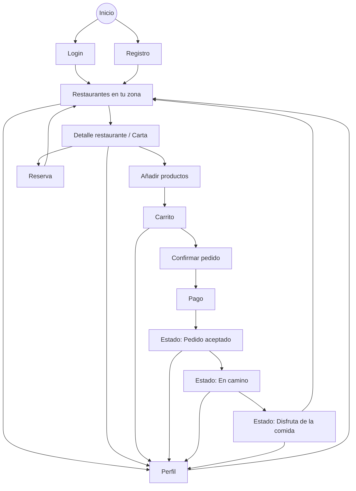

# 📄 Documentación Proyecto Final - PMDM

Rellena este documento e incluyelo dentro de la carpeta `/docs` del repositorio.

## 1. Información del Alumno/a

- **Individual/Grupo**: [Individual]
- **Nombre y Apellidos: alumno-1**: [Pedro ]
- **Nombre y Apellidos: alumno-2**: [Guerrero Blanco]
- **Nombre del Proyecto**: [PideYa]
- **URL del Repositorio (Privado)**: [https://github.com/Guerblan/2526_PMDM_PracticaFinal_GuerreroPedro]

## 2. Descripción del Proyecto

PideYa es una aplicación móvil de gestión digital de pedidos y reservas para negocios de restauración, diseñada para reducir colas y aglomeraciones en situaciones donde se produce un pico puntual de demanda (festivales, cafeterías en edificios administrativos, estadios durante el descanso, food trucks, etc.).

El problema principal que resuelve es que en estos contextos los clientes pierden mucho tiempo esperando, y los locales sufren colapso operativo, lo que puede degradar la calidad del servicio y del producto. Con PideYa, el usuario puede hacer el pedido y pagar desde el móvil, y recibir un seguimiento del estado del pedido hasta que se le avisa de que está listo. En ese momento, el cliente solo tiene que acercarse al local y recogerlo, evitando esperas innecesarias.

La aplicación va dirigida a:

Clientes que quieren comprar comida/bebida sin perder tiempo en colas.

Negocios de restauración que necesitan mejorar la gestión de pedidos y reservas en momentos de alta demanda.

Su temática principal es la digitalización del proceso de pedido/reserva y recogida, enfocándose en una experiencia rápida y controlada, diferenciándose de apps como Just Eat, Glovo o Uber Eats porque no requiere repartidores: el cliente recoge su pedido directamente en el local (normalmente cercano).

## 3. Características Principales (Features)

- ### 1: Registro de usuario

El usuario puede registrarse introduciendo nombre, email, contraseña y cuenta bancaria, para poder usar la app y asociar pagos al perfil.

- ### Feature 2: Inicio de sesión

El usuario puede iniciar sesión con email + contraseña, con validación y mensajes de error si los datos son incorrectos.

- ### Feature 3: Ver restaurantes disponibles

El usuario puede ver una lista de restaurantes disponibles, viendo al menos nombre y tipo de comida, y acceder a la ficha/detalles del restaurante.

- ### Feature 4: Hacer reserva

El usuario puede reservar seleccionando una hora, y el sistema valida disponibilidad antes de confirmarla.

- ### Feature 5: Realizar pedido con pago

El usuario puede consultar la oferta del restaurante, hacer un pedido y pagarlo desde la app.

- ### Feature 6: Seguimiento del pedido en tiempo real

El usuario puede ver el estado del pedido actualizado, hasta recibir el aviso de “listo para recoger”.

## 4. Diagrama de Flujo de Navegación



## 5. Casos de Uso

| ID    | Caso de Uso                   | Descripción                                                                          | Prioridad |
| :---- | :---------------------------- | :----------------------------------------------------------------------------------- | :-------- |
| UC-01 | Login de usuario              | El usuario accede con sus credenciales (email + contraseña) para iniciar sesión.     | Alta      |
| UC-02 | Registro de usuario           | El usuario crea una cuenta nueva introduciendo sus datos para poder usar la app.     | Alta      |
| UC-03 | Ver restaurantes              | El usuario consulta la lista de restaurantes disponibles en su zona.                 | Alta      |
| UC-04 | Ver carta/detalle restaurante | El usuario accede al detalle de un restaurante y visualiza su carta/productos.       | Alta      |
| UC-05 | Añadir productos al carrito   | El usuario añade productos desde la carta al carrito, ajustando cantidades.          | Alta      |
| UC-06 | Gestionar carrito             | El usuario revisa el carrito y puede modificar cantidades o eliminar productos.      | Alta      |
| UC-07 | Confirmar pedido              | El usuario confirma el pedido revisando el resumen (productos y total).              | Alta      |
| UC-08 | Realizar pago                 | El usuario paga el pedido desde la aplicación con un método de pago disponible.      | Alta      |
| UC-09 | Seguimiento del pedido        | El usuario consulta el estado del pedido (aceptado, en camino/listo) en tiempo real. | Alta      |
| UC-10 | Ver/editar perfil             | El usuario consulta y actualiza información básica de su perfil.                     | Media     |

## 6. Arquitectura Técnica

[Describe brevemente cómo has implementado las capas solicitadas en el enunciado]

- **Capa de Presentación (UI)**: [Jetpack Compose + Navigation Compose para pantallas y navegación. ViewModels para gestionar estado de UI y eventos del usuario.]
- **Capa de Negocio**: [UseCases que encapsulan la lógica principal (login, registro, ver restaurantes, añadir al carrito, confirmar pedido, pago, seguimiento). Interfaces de repositorios para desacoplar dominio de la fuente de datos.]
- **Capa de Datos**: [Retrofit para consumo de API REST (remote datasource), Room/DataStore para persistencia local (local datasource). Repositorios concretos que combinan datos remotos/locales y mapean DTOs ↔ modelos de dominio.]

## 7. Persistencia y Red

- **Persistencia Local**: [Room para guardar datos de negocio (restaurantes, productos/carta, carrito y pedidos) y DataStore/SharedPreferences para guardar preferencias y sesión del usuario (token/login, usuario actual, configuración básica).]
- **API REST**: [Se consume una API REST para autenticación de usuarios y obtención/gestión de datos: listado de restaurantes, detalle/carta, creación de pedidos, pago (simulado) y actualización/consulta del estado del pedido para el seguimiento en tiempo real.]

## 8. Planificación de Entregas

[Indica qué funcionalidades o tareas te comprometes a entregar en cada fase]

### 📅 Entrega Parcial 1 (13 de Febrero)

- **Hito 1**: [Creación del proyecto Android en Android Studio, configuración inicial (Gradle/libs), estructura por capas (UI/Dominio/Datos) y repositorio en GitHub con primeros commits.]
- **Funcionalidades**: [Pantallas iniciales + navegación base: Splash/Inicio, Login, Registro y Home simple (lista mock de restaurantes sin API).]
- **Otras tareas**: [Definición de modelos de datos básicos (User, Restaurant, Product), creación de ViewModels + estado UI, y navegación con Navigation Compose entre pantallas.]

### 📅 Entrega Parcial 2 (27 de Febrero)

- **Hito 2**: [Integración de Red/Persistencia, etc.]
- **Funcionalidades**: [Listado de items desde API, guardado en favoritos...]
- **Otras tareas**: [Mappers, Repositorios reales...]

### 📅 Entrega Final (12 de Marzo)

- **Hito Final**: [Pulido de UI, Internalización, etc.]
- **Funcionalidades**: [Ajustes finales, perfil de usuario...]
- **Otras tareas**: [Soporte Multi-idioma (ES/EN), APK generado...]

---

> [!IMPORTANT]
> Recuerda que en cada entrega debes crear un **Release** en Github.

```

```
