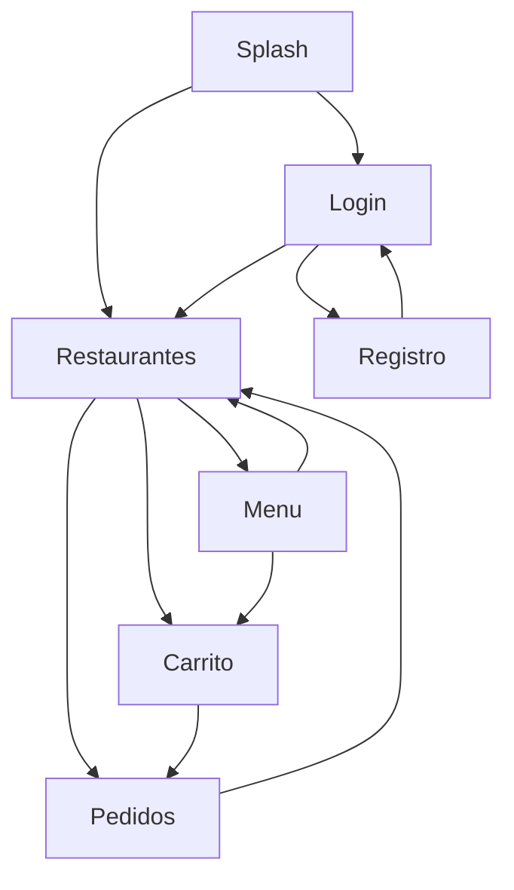

# Documentacion Proyecto Final - PMDM

## 1. Informacion del Alumno/a

- Individual/Grupo: Individual
- Nombre y Apellidos: Pedro Guerrero
- Nombre del Proyecto: LaJuani
- URL del Repositorio (Privado): `https://github.com/Guerblan/2526_PMDM_PracticaFinal_GuerreroPedro`

## 2. Descripcion del Proyecto

LaJuani es una aplicacion Android desarrollada en Kotlin orientada a la gestion simulada de pedidos de comida a domicilio.

La aplicacion permite a un usuario registrarse o iniciar sesion, consultar restaurantes por categorias, ver los productos disponibles de cada restaurante, anadir productos al carrito y confirmar pedidos. Tambien incorpora seguimiento del pedido actual, historial de pedidos y valoracion de restaurantes.

El proyecto esta dirigido a poner en practica los contenidos principales del modulo de Programacion Multimedia y Dispositivos Moviles, aplicando Jetpack Compose, navegacion, persistencia local, autenticacion e internacionalizacion.

## 3. Caracteristicas Principales (Features)

- Autenticacion de usuario mediante login y registro.
- Navegacion entre varias pantallas con Navigation Compose.
- Catalogo de restaurantes con filtrado por categorias.
- Visualizacion del menu de cada restaurante.
- Carrito de compra con control de productos por restaurante.
- Confirmacion y pago del pedido actual.
- Historial de pedidos almacenado en local.
- Valoracion de restaurantes con estrellas.
- Cambio de idioma entre espanol e ingles desde la propia interfaz.
- Persistencia de sesion, idioma y preferencias del usuario.

## 4. Diagrama de Flujo de Navegacion

## 5. Casos de Uso

| ID | Caso de Uso | Descripcion | Prioridad |
| --- | --- | --- | --- |
| UC-01 | Login de usuario | El usuario accede a la aplicacion con sus credenciales. | Alta |
| UC-02 | Registro de usuario | El usuario crea una nueva cuenta. | Alta |
| UC-03 | Cerrar sesion | El usuario finaliza su sesion actual. | Media |
| UC-04 | Consultar restaurantes | El usuario visualiza el listado de restaurantes disponibles. | Alta |
| UC-05 | Filtrar por categoria | El usuario filtra los restaurantes por tipo de comida. | Media |
| UC-06 | Ver menu de restaurante | El usuario consulta los productos de un restaurante. | Alta |
| UC-07 | Anadir producto al carrito | El usuario anade productos al carrito. | Alta |
| UC-08 | Eliminar producto del carrito | El usuario elimina productos del carrito. | Media |
| UC-09 | Confirmar pedido | El usuario confirma el pedido actual. | Alta |
| UC-10 | Realizar pago del pedido | El usuario marca el pedido como pagado. | Alta |
| UC-11 | Consultar estado del pedido | El usuario revisa el estado del pedido actual. | Media |
| UC-12 | Consultar historial de pedidos | El usuario consulta pedidos anteriores. | Media |
| UC-13 | Valorar restaurante | El usuario asigna estrellas a un restaurante. | Baja |
| UC-14 | Cambiar idioma | El usuario cambia el idioma de la aplicacion. | Media |

## 6. Arquitectura Tecnica

El proyecto sigue una arquitectura por capas:

- Capa de Presentacion (UI): desarrollada con Jetpack Compose. Incluye `MainActivity`, pantallas, componentes reutilizables, navegacion, `ViewModel` y clases `UiState`.
- Capa de Negocio: formada por casos de uso que encapsulan la logica principal de la aplicacion.
- Capa de Datos: formada por repositorios, data sources, mappers, `SharedPreferences` y base de datos local con Room.

Esta separacion facilita el mantenimiento del proyecto y permite organizar mejor la logica y el acceso a datos.

## 7. Persistencia y Red

- Persistencia Local:
  - `SharedPreferences` para guardar idioma, categoria seleccionada y datos basicos de sesion.
  - `Room` para almacenar carrito, pedidos y valoraciones de restaurantes.
- Red:
  - Firebase Authentication para login y registro de usuarios.
  - No se consume una API REST externa en esta version del proyecto.

## 8. Tecnologias Utilizadas

- Kotlin
- Jetpack Compose
- Material 3
- Navigation Compose
- ViewModel
- Room
- SharedPreferences
- Firebase Authentication

## 9. Estado Actual del Proyecto

Actualmente el proyecto compila y se ejecuta correctamente en Android Studio. La aplicacion cumple los requisitos minimos del enunciado y ademas incorpora funcionalidades adicionales, como el cambio de idioma en tiempo real y una interfaz visual personalizada.

## 10. Mejoras Futuras

- Mejorar la validacion de formularios.
- Incorporar imagenes y datos desde servicios externos.
- Anadir gestion de perfil de usuario.
- Incluir notificaciones de estado de pedido.
- Ampliar el sistema de pagos y seguimiento.
