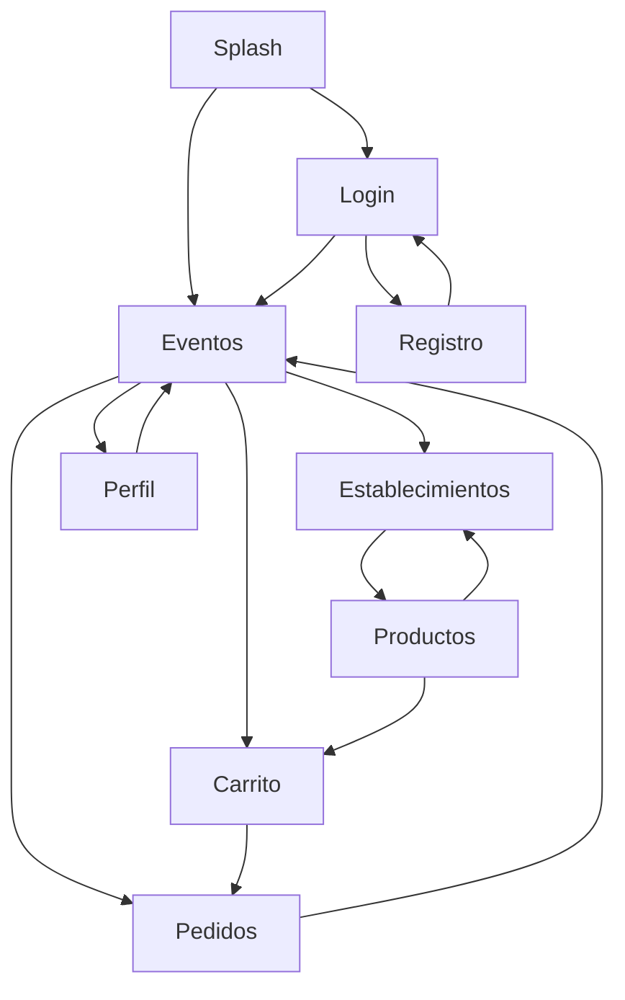

# Documentacion Proyecto Final - PMDM

## 1. Informacion del Alumno/a

- Individual/Grupo: Individual
- Nombre y Apellidos: Pedro Guerrero
- Nombre del Proyecto: PideYa
- URL del Repositorio (Privado): `https://github.com/Guerblan/2526_PMDM_PracticaFinal_GuerreroPedro`

## 2. Descripcion del Proyecto

PideYa es una aplicacion Android desarrollada en Kotlin orientada a la gestion simulada de pedidos en eventos con recogida en establecimiento.

La aplicacion permite a un usuario registrarse o iniciar sesion, consultar eventos disponibles, ver los establecimientos de cada evento, seleccionar productos, anadirlos al carrito y confirmar pedidos. Tambien incorpora historial de pedidos, perfil basico y cambio de idioma entre espanol e ingles.

El proyecto esta dirigido a poner en practica los contenidos principales del modulo de Programacion Multimedia y Dispositivos Moviles, aplicando Jetpack Compose, navegacion, persistencia local, autenticacion e internacionalizacion.

## 3. Caracteristicas Principales

- Autenticacion de usuario mediante login y registro.
- Navegacion entre varias pantallas con Navigation Compose.
- Listado de eventos disponibles.
- Visualizacion de establecimientos por evento.
- Visualizacion de productos por establecimiento.
- Carrito de compra con control de productos por establecimiento.
- Confirmacion y seguimiento basico del pedido actual.
- Historial de pedidos almacenado en local.
- Perfil basico de usuario.
- Cambio de idioma entre espanol e ingles desde la propia interfaz.
- Persistencia de sesion, idioma y pedidos del usuario.

## 4. Diagrama de Flujo de Navegacion

## 5. Casos de Uso

| ID | Caso de Uso | Descripcion | Prioridad |
| --- | --- | --- | --- |
| UC-01 | Login de usuario | El usuario accede a la aplicacion con sus credenciales. | Alta |
| UC-02 | Registro de usuario | El usuario crea una nueva cuenta. | Alta |
| UC-03 | Cerrar sesion | El usuario finaliza su sesion actual. | Media |
| UC-04 | Consultar eventos | El usuario visualiza el listado de eventos disponibles. | Alta |
| UC-05 | Ver establecimientos | El usuario consulta los establecimientos de un evento. | Alta |
| UC-06 | Ver productos | El usuario consulta los productos de un establecimiento. | Alta |
| UC-07 | Anadir producto al carrito | El usuario anade productos al carrito. | Alta |
| UC-08 | Eliminar producto del carrito | El usuario elimina productos del carrito. | Media |
| UC-09 | Confirmar pedido | El usuario confirma el pedido actual. | Alta |
| UC-10 | Marcar pedido como pagado | El usuario actualiza el estado del pedido actual. | Media |
| UC-11 | Consultar estado del pedido | El usuario revisa el estado del pedido actual. | Media |
| UC-12 | Consultar historial de pedidos | El usuario consulta pedidos anteriores. | Media |
| UC-13 | Consultar perfil | El usuario visualiza su cuenta y opciones basicas. | Baja |
| UC-14 | Cambiar idioma | El usuario cambia el idioma de la aplicacion. | Media |

## 6. Arquitectura Tecnica

El proyecto sigue una arquitectura por capas:

- Capa de Presentacion (UI): desarrollada con Jetpack Compose. Incluye `MainActivity`, pantallas, componentes reutilizables, navegacion, `ViewModel` y clases `UiState`.
- Capa de Negocio: formada por casos de uso que encapsulan la logica principal de la aplicacion.
- Capa de Datos: formada por repositorios, data sources, mappers, `SharedPreferences` y base de datos local con Room.

Esta separacion facilita el mantenimiento del proyecto y permite organizar mejor la logica y el acceso a datos.

## 7. Persistencia y Red

- Persistencia Local:
  - `SharedPreferences` para guardar idioma, sesion y credenciales locales de prueba.
  - `Room` para almacenar carrito y pedidos.
- Red:
  - No se consume una API REST externa.
  - La version minima funciona en local y no depende de Firebase.

## 8. Tecnologias Utilizadas

- Kotlin
- Jetpack Compose
- Material 3
- Navigation Compose
- ViewModel
- Room
- SharedPreferences

## 9. Estado Actual del Proyecto

La base del proyecto esta reorientada a PideYa y alineada con una version minima del enunciado: varias pantallas, navegacion, autenticacion local, persistencia y cambio de idioma. El proyecto compila correctamente y genera APK en modo `debug` y `release`.

## 10. Compilacion y APK

- Compilacion debug verificada con `assembleDebug`.
- Compilacion release verificada con `assembleRelease`.
- APK debug generado en `app/build/outputs/apk/debug/app-debug.apk`.
- APK release generado en `app/build/outputs/apk/release/app-release-unsigned.apk`.

## 11. Mejoras Futuras

- Mejorar la validacion de formularios.
- Incorporar imagenes y datos desde servicios externos.
- Incluir notificaciones de estado de pedido.
- Ampliar el sistema de pagos y seguimiento.
